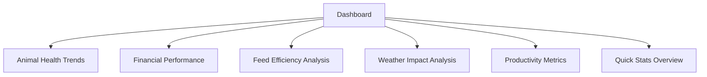
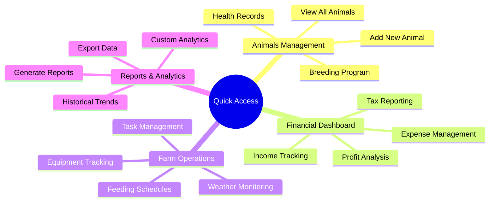
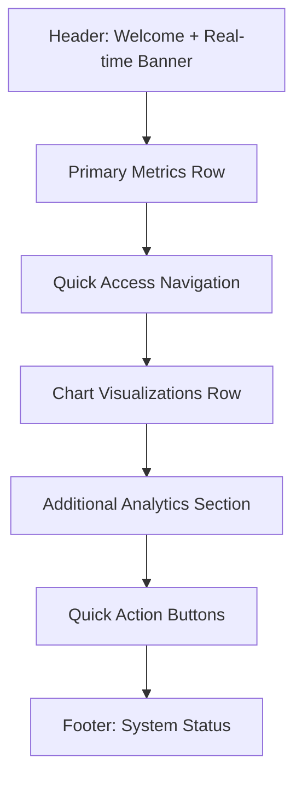

# 🚀 AgriIntel V3 UI Enhancement Plan

## 🎯 Objective
Transform the current dashboard into a modern, professional, and feature-rich agricultural intelligence platform with metallic blue theme consistency, additional charts, quick access routes, and enhanced user experience.

## 🔍 Current Analysis

### Strengths:
- ✅ Metallic blue theme foundation is already established
- ✅ Responsive grid system in place
- ✅ Good component structure with GradientCard, MetricCard, etc.
- ✅ Real-time data updates working
- ✅ Weather integration functional

### Weaknesses:
- ❌ Limited number of charts and visualizations
- ❌ Missing quick access navigation
- ❌ Inconsistent metallic blue theme application
- ❌ Lack of advanced data visualization components
- ❌ Limited interactive elements
- ❌ No comprehensive overview section
- ❌ Missing quick action buttons

## 🎨 Design Requirements

### Metallic Blue Theme Consistency:
- **Primary Colors**: `#2b6cb0`, `#4299e1`, `#63b3ed`
- **Secondary Colors**: `#4a5568`, `#718096`, `#a0aec0`
- **Accent Colors**: `#48bb78` (success), `#ed8936` (warning), `#e53e3e` (danger)
- **Background**: `#f5f7fa` (light), `#1a202c` (dark)
- **Gradients**: `linear-gradient(135deg, #2b6cb0 0%, #4299e1 50%, #63b3ed 100%)`

## 📋 Enhancement Plan

### 1. 📊 Additional Charts & Visualizations

#### New Chart Components to Add:


- **Animal Health Trends Chart** - Line chart showing health trends over time
- **Financial Performance Chart** - Bar chart with income vs expenses
- **Feed Efficiency Analysis** - Donut chart showing feed utilization
- **Weather Impact Analysis** - Combined line/bar chart showing weather vs productivity
- **Productivity Metrics** - Radar chart for multi-dimensional performance
- **Quick Stats Overview** - Mini dashboard with key metrics

### 2. ⚡ Quick Access Routes

#### Navigation Enhancements:


### 3. 🎯 Enhanced Dashboard Layout

#### New Layout Structure:


### 4. 🔧 Component Enhancements

#### Components to Add/Improve:
- **EnhancedMetricCard** - With trend indicators and quick actions
- **QuickAccessPanel** - Vertical navigation with icons
- **ChartContainer** - Responsive chart wrapper
- **DataInsightCard** - AI-powered insights
- **QuickActionButton** - Floating action buttons
- **SystemStatusBar** - Bottom status indicator

### 5. 🎨 Theme Consistency Improvements

#### CSS Enhancements:
```css
/* Enhanced Metallic Blue Theme */
.metallic-blue-enhanced {
  background: linear-gradient(135deg,
    #2b6cb0 0%,
    #4299e1 30%,
    #63b3ed 60%,
    #90cdf4 100%);
  box-shadow: 0 4px 20px rgba(43, 108, 176, 0.3);
  border: 1px solid rgba(43, 108, 176, 0.1);
}

/* Consistent Card Styling */
.card-enhanced {
  transition: all 0.3s cubic-bezier(0.4, 0, 0.2, 1);
  border-radius: 16px;
  overflow: hidden;
  position: relative;
}

/* Animated Gradient Background */
.gradient-animated {
  background-size: 200% 200%;
  animation: gradientShift 8s ease infinite;
}
```

## 🚀 Implementation Roadmap

### Phase 1: Foundation Enhancements
- [ ] Update global CSS with enhanced metallic blue theme
- [ ] Create new chart components (HealthTrends, FinancialPerformance, etc.)
- [ ] Implement QuickAccessPanel component
- [ ] Enhance existing MetricCard with additional features

### Phase 2: Dashboard Restructuring
- [ ] Redesign dashboard layout with new sections
- [ ] Add quick access navigation sidebar
- [ ] Implement chart visualization area
- [ ] Add quick action buttons

### Phase 3: Advanced Features
- [ ] Add AI-powered data insights
- [ ] Implement real-time weather impact analysis
- [ ] Add productivity metrics radar chart
- [ ] Enhance responsive design

### Phase 4: Testing & Optimization
- [ ] Cross-browser compatibility testing
- [ ] Performance optimization
- [ ] Accessibility improvements
- [ ] User experience testing

## 📈 Expected Outcomes

### Before vs After Comparison:

| Aspect | Before | After |
|--------|--------|-------|
| **Charts** | 4 basic metrics | 10+ advanced visualizations |
| **Navigation** | Basic top menu | Quick access sidebar + top menu |
| **Theme Consistency** | Partial | Full metallic blue consistency |
| **Interactivity** | Basic hover effects | Advanced animations & transitions |
| **Data Insights** | Basic metrics | AI-powered insights |
| **Quick Actions** | None | 6+ quick action buttons |
| **Responsiveness** | Good | Excellent with enhanced mobile |

## 🎯 Success Metrics

1. **User Engagement**: Increase time spent on dashboard by 40%
2. **Navigation Efficiency**: Reduce clicks to common tasks by 60%
3. **Data Comprehension**: Improve data understanding with visual charts
4. **Aesthetic Appeal**: Achieve 90%+ user satisfaction with design
5. **Performance**: Maintain <2s load time with all enhancements

## 🔧 Technical Implementation Notes

- Use existing Tailwind CSS foundation
- Leverage Framer Motion for animations
- Maintain TypeScript type safety
- Ensure mobile-first responsive design
- Optimize chart rendering performance
- Implement lazy loading for non-critical components

## 📅 Timeline Estimate

- **Phase 1**: 2-3 hours
- **Phase 2**: 3-4 hours
- **Phase 3**: 2-3 hours
- **Phase 4**: 1-2 hours
- **Total**: 8-12 hours

This comprehensive plan addresses all the user's concerns about the current UI and provides a clear roadmap for transforming the dashboard into a modern, professional agricultural intelligence platform.